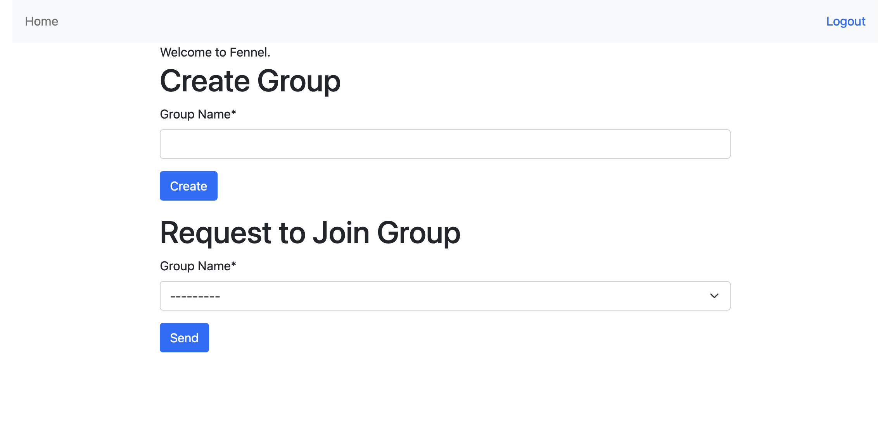
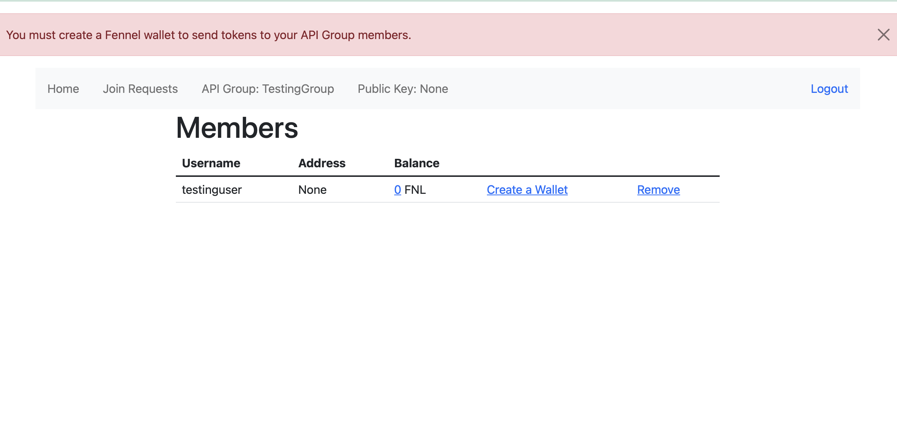
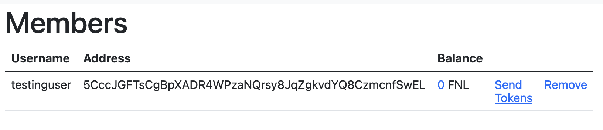
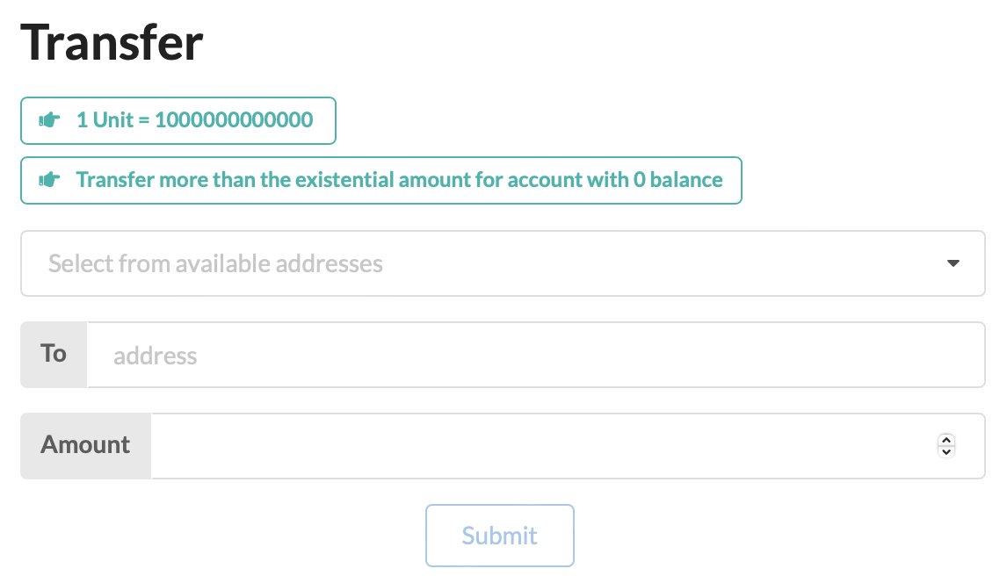

# Fennel

## Running the Distribution

In order to run everything, you'll just need to run

```bash
$ git submodule init
$ git submodule update
```

to pull the latest version of all included services.

Then, run

```bash
$ docker compose up
```

to run local copies of all required services.

## Accessing the App

You'll find Fennel Labs' build of the app at http://localhost:3000.

## Communicating with the API

Point any apps you need to interact with the Fennel API at http://localhost:1234/api/v1/. The API might take several minutes to run all tests and confirm full availability.

## Configuring Your Account
You'll need someone set up as an administrator of an API group in order to manage accounts and their related blockchain assets. Navigate to http://localhost:1234/dashboard/ to get started. You'll need to create an account, then follow the instructions on-screen to get set up with a group and a blockchain address.



From there, click Create a Wallet to get an address on our blockchain. This will give you a sequence of letters and numbers that you'll need to use to send yourself tokens.





Paste that into the receiving field in the form on the blockchain's interface (https:/localhost:8000), and select one of the pre-funded accounts as the sender. You'll see your token count increase in the dashboard when the transaction completes.



## Managing the Blockchain

The blockchain will fully build itself and begin running a local copy of a fully-functioning blockchain as soon as you start the Compose setup. You'll need to navigate to http://localhost:8000 and make sure that the address you created during account setup has received tokens. See Configuring Your Account for details.
